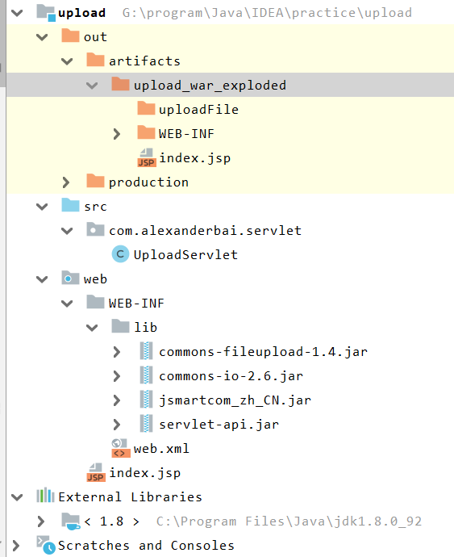
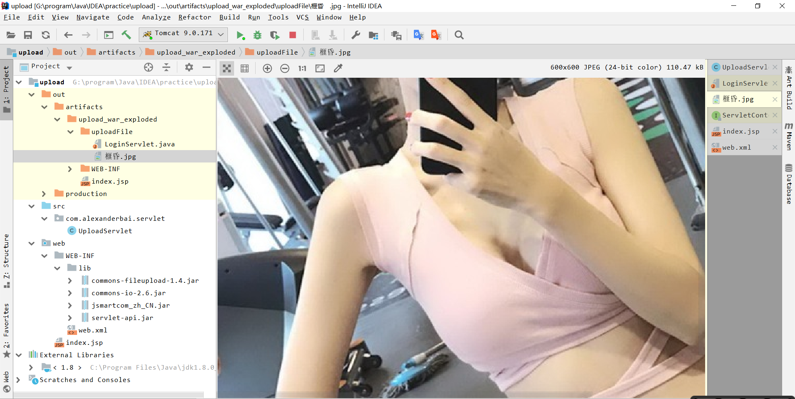
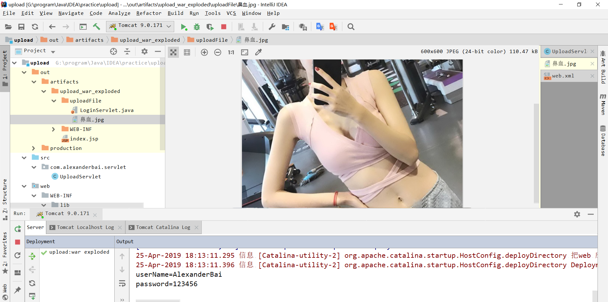

## 一、提交表单

提交表单

- 只需要指定文件类型，表单进行了二进制封装，故不需要指定MIME类型
- MIME类型：是一种互联网规范。是设定某种扩展名的文件用一种应用程序打开的方式（通俗地说就是规定文件打开的方式）。
- 从上可以看出常见的如HTML、Java、GIF等一些文件都遵循MIME规范

```jsp
<%@ page contentType="text/html;charset=UTF-8" language="java" %>
<html>
  <head>
    <title>登录/title>
  </head>
  <body>
  <form action="/login" method="post">
    用户：<input type="text" name="userName"><br>
    密码：<input type="password" name="password"><br>
    <input type="submit" value="确定"><br>
  </form>
  </body>
</html>
```

- 服务器端可以通过**`getParameter()`**获取表单数据。


## 二、上传文件与提交表单区别

- 上传的数据其实是以二进制的形式进行上传，所以需要指定MIME类型
  - 在from标签中加上**`enctype="multipart/form-data"`**

```jsp
<%@ page contentType="text/html;charset=UTF-8" language="java" %>
<html>
  <head>
    <title>文件上传</title>
  </head>
  <body>
  <form action="" enctype="multipart/form-data"  method="post">
    上传用户：<input type="text" name="userName"><br>
    上传文件1：<input type="file" name="file1"><br>
    上传文件2：<input type="file" name="file2"><br>
    <input type="submit" value="提交"><br>
  </form>
  </body>
</html>
```

- 服务器端不能通过**`getParameter()`**获取上传的文件，也就是说`getParameter()`方法对二进制不起作用,由此引入**上传组件**

## 三、读取上传文件的数据

前端页面

```jsp
<%@ page contentType="text/html;charset=UTF-8" language="java" %>
<html>
  <head>
    <title>文件上传</title>
  </head>
  <body>
  <form action="UploadServlet" enctype="multipart/form-data" method="post">
    上传用户：<input type="text" name="userName"><br>
    上传密码：<input type="password" name="password"><br>
    上传文件1：<input type="file" name="file1"><br>
    上传文件2：<input type="file" name="file2"><br>
    <input type="submit" value="提交"><br>
  </form>
  </body>
</html>
```


#### 1、上传组件

>- **FileUpload**
>
>- **SmartUpload**


#####（1）、FileUpload

依赖于`FileUpload.jar`

- 创建解析器工厂
- 解析器工厂创建解析器
- 遍历List，判断每个对象是否是上传文件
  - 如果是普通字段，得到字段名和字段值
  - 如果是是上传文件，使用InputStream写入到指定目录

```java
package com.alexanderbai.servlet;

import org.apache.commons.fileupload.FileItem;
import org.apache.commons.fileupload.FileUploadException;
import org.apache.commons.fileupload.disk.DiskFileItemFactory;
import org.apache.commons.fileupload.servlet.ServletFileUpload;

import javax.servlet.ServletException;
import javax.servlet.http.HttpServletRequest;
import javax.servlet.http.HttpServletResponse;
import java.io.FileOutputStream;
import java.io.IOException;
import java.io.InputStream;
import java.util.List;

/**
 * @Description TODO
 * @Author AlexanderBai
 * @Data 2019/4/25 16:13
 **/
@javax.servlet.annotation.WebServlet(name = "UploadServlet",urlPatterns = "/UploadServlet")
public class UploadServlet extends javax.servlet.http.HttpServlet {
    protected void doPost(HttpServletRequest request, HttpServletResponse response) throws ServletException, IOException {
        //1、获取解析器工厂
        DiskFileItemFactory diskFileItemFactory=new DiskFileItemFactory();
        //2、获取解析器
        ServletFileUpload servletFileUpload=new ServletFileUpload(diskFileItemFactory);
        //判断上传表单的类型
        if (!servletFileUpload.isMultipartContent(request)) {
            //上传为普通表单，
            System.out.println(request.getParameter("userName"));
            System.out.println(request.getParameter("password"));
            return;
        }
        //为上传文件表单，调用解析器解析器解析上传数据
        try {
            List<FileItem> fileItems=servletFileUpload.parseRequest(request);

            //遍历List，得到用于封装第一个上传输入项数据fileItem对象
            for (FileItem fileItem : fileItems) {

                if (fileItem.isFormField()) {
                    //得到的是普通的输入项
                    String name = fileItem.getFieldName();//获取输入项的名称
                    String value = fileItem.getString();
                    System.out.println(name + "=" + value);
                } else {
                    //得到上传输入项
                    String fileName=fileItem.getName();//获取上传输入名
                    fileName=fileName.substring(fileName.lastIndexOf("\\" )+1);
                    InputStream inputStream = fileItem.getInputStream();//获取上传数据

                    int len=0;
                    byte bytes[] = new byte[1024];

                    //新建一个目录
                    String savePath=this.getServletContext().getRealPath("/upload");

                    //向upload目录中写入数据
                    FileOutputStream fileOutputStream=new FileOutputStream(savePath + "\\" + fileName);
                    while ((len = inputStream.read(bytes)) > 0) {
                        fileOutputStream.write(bytes,0,len);
                    }
                    inputStream.close();
                    fileOutputStream.close();
                }
            }
        } catch (FileUploadException e) {
            e.printStackTrace();
        }
    }
}
```

#####（2）、SmartUpload

- 依赖于`jsmartUpload.jar`

```java
package com.alexanderbai.servlet;

import com.jspsmart.upload.SmartUpload;
import com.jspsmart.upload.SmartUploadException;

import javax.servlet.ServletException;
import javax.servlet.http.HttpServletRequest;
import javax.servlet.http.HttpServletResponse;
import java.io.IOException;

/**
 * @Description TODO
 * @Author AlexanderBai
 * @Data 2019/4/25 16:13
 **/
@javax.servlet.annotation.WebServlet(name = "UploadServlet",urlPatterns = "/UploadServlet")
public class UploadServlet extends javax.servlet.http.HttpServlet {
    protected void doPost(HttpServletRequest request, HttpServletResponse response) throws ServletException, IOException {
        //实例化组件
        SmartUpload smartUpload = new SmartUpload();

        //初始化上传操作
        smartUpload.initialize(this.getServletConfig(),request,response);

        try {
            //上传准备
            smartUpload.upload();
            //对于普通的数据，单纯用request对象是无法获取的，也是需要依赖smartUpload
            System.out.println(request.getParameter("username"));
            String userName=smartUpload.getRequest().getParameter("userName");
            String password=smartUpload.getRequest().getParameter("password");
            System.out.println(userName);
            System.out.println(password);
            //上传到uploadFile文件中
            smartUpload.save("uploadFile");

        } catch (SmartUploadException e) {
            e.printStackTrace();
        }
    }
}
```

##### （3）、测试

项目目录，确定测试前uploadFile目录存在，用于存放上传的文件



- 运行效果



**已经运行成功，当时发现文件名乱码了**

##四、编码问题

####1、FileUpload

修改两处

- 解决中文文件名乱码：**得到解析器后，设置解析器的编码为UTF-8**

```java
 servletFileUpload.setHeaderEncoding("UTF-8");
```

- 解决表单数据乱码：**在获取表单值的时候，按照UTF-8编码方式获取**

```java
String value = fileItem.getString("UTF-8");
```

再次运行



#### 2、SmartUpload

这个找不到教程，涉及到中文还是用`UploadServletByFileUpload`


**[完整代码](https://github.com/AlexanderBai/Upload.git)**


